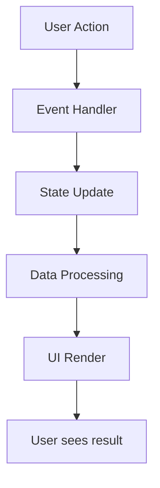

# 👨‍💻 دليل المطور - منصة زيوت السيارات الذكية

## 📚 جدول المحتويات
1. [معمارية التطبيق](#architecture)
2. [دليل API](#api-guide)
3. [إدارة الحالة](#state-management)
4. [تكامل AI](#ai-integration)
5. [أفضل الممارسات](#best-practices)

---

## 🏛️ معمارية التطبيق {#architecture}

### هيكل المكونات

```
Application Layer
│
├── Presentation Layer (UI)
│   ├── index.html (Structure)
│   ├── styles.css (Styling)
│   └── Components
│       ├── Header
│       ├── Hero
│       ├── Filters
│       ├── Product Views (Table/Grid)
│       ├── AI Assistant Modal
│       └── Statistics Modal
│
├── Business Logic Layer
│   ├── app.js (Core Logic)
│   ├── Data Management
│   ├── Filter Engine
│   ├── AI Integration
│   └── Event Handlers
│
├── Data Layer
│   └── oil_shop_complete.json
│
└── Service Layer
    ├── Service Worker (sw.js)
    ├── Cache Management
    └── Offline Support
```

### تدفق البيانات



---

## 🔌 دليل API {#api-guide}

### 1. تحميل البيانات

```javascript
async function loadData() {
  try {
    const response = await fetch('oil_shop_complete.json');
    const data = await response.json();
    products = data.products || [];
    categories = data.categories || [];
    allProducts = [...products];
    return data;
  } catch (error) {
    console.error('Error loading data:', error);
    throw error;
  }
}
```

### 2. تكامل Claude AI API

#### طلب أساسي
```javascript
const response = await fetch('https://api.anthropic.com/v1/messages', {
  method: 'POST',
  headers: {
    'Content-Type': 'application/json',
    'anthropic-version': '2023-06-01'
  },
  body: JSON.stringify({
    model: 'claude-sonnet-4-20250514',
    max_tokens: 1000,
    messages: [
      {
        role: 'user',
        content: 'Your question here'
      }
    ]
  })
});
```

#### معالجة الاستجابة
```javascript
const data = await response.json();
if (data.content && data.content[0]) {
  const aiResponse = data.content[0].text;
  // Process response
}
```

### 3. واجهات المنتجات

#### Product Interface
```typescript
interface Product {
  id: number;
  category_id: number;
  category_name: string;
  category_name_english: string;
  product_name: string;
  liters: number | null;
  wholesale_price: number;
  unit: string;
  created_at: string | null;
}
```

#### Category Interface
```typescript
interface Category {
  id: number;
  name: string;
  name_english: string;
  description: string;
}
```

---

## 🗄️ إدارة الحالة {#state-management}

### Global State Variables

```javascript
// Application State
let products = [];           // Current filtered products
let categories = [];         // All categories
let allProducts = [];        // Original unfiltered products
let currentView = 'table';   // Current view mode
let aiConversationHistory = []; // AI chat history
```

### State Management Functions

#### تحديث حالة الفلاتر
```javascript
function applyFilters() {
  const filters = {
    search: document.getElementById('searchInput').value,
    category: document.getElementById('categoryFilter').value,
    pack: document.getElementById('packFilter').value,
    sort: document.getElementById('sortFilter').value,
    minPrice: parseFloat(document.getElementById('minPrice').value) || 0,
    maxPrice: parseFloat(document.getElementById('maxPrice').value) || Infinity
  };
  
  // Apply all filters
  let filtered = filterProducts(allProducts, filters);
  
  // Update state
  products = filtered;
  
  // Re-render
  renderProducts();
}
```

#### إدارة العرض
```javascript
function changeViewMode() {
  const viewMode = document.getElementById('viewMode').value;
  currentView = viewMode;
  
  // Toggle visibility
  document.getElementById('tableView').style.display = 
    viewMode === 'table' ? 'block' : 'none';
  document.getElementById('gridView').style.display = 
    viewMode === 'grid' ? 'block' : 'none';
  
  renderProducts();
}
```

---

## 🤖 تكامل AI {#ai-integration}

### معمارية AI Assistant

```
User Input
    ↓
Preprocessing (Add Context)
    ↓
API Call to Claude
    ↓
Response Processing
    ↓
UI Update
```

### إعداد السياق للمنتجات

```javascript
function prepareProductsContext() {
  const categoryGroups = {};
  
  // Group products by category
  allProducts.forEach(p => {
    if (!categoryGroups[p.category_name]) {
      categoryGroups[p.category_name] = [];
    }
    if (categoryGroups[p.category_name].length < 3) {
      categoryGroups[p.category_name].push(p);
    }
  });

  // Build context string
  let context = 'التصنيفات المتاحة:\n';
  Object.keys(categoryGroups).forEach(cat => {
    context += `\n${cat}:\n`;
    categoryGroups[cat].forEach(p => {
      context += `  - ${p.product_name} (${p.liters}L) - ${p.wholesale_price} EGP\n`;
    });
  });

  return context;
}
```

### بناء رسالة AI

```javascript
const systemPrompt = `أنت مساعد ذكي متخصص في منصة زيوت السيارات. 
لديك معلومات عن ${allProducts.length} منتج.

معلومات المنتجات المتاحة:
${productsContext}

يرجى تقديم إجابات مفيدة وودية. إذا كان السؤال يتعلق بتوصيات منتجات، 
قدم اقتراحات محددة مع الأسعار.`;
```

### إدارة سجل المحادثة

```javascript
// Add to conversation history
aiConversationHistory.push(
  { role: 'user', content: userMessage },
  { role: 'assistant', content: aiResponse }
);

// Limit history size (keep last 10 messages)
if (aiConversationHistory.length > 10) {
  aiConversationHistory = aiConversationHistory.slice(-10);
}
```

---

## 🎨 معالجة واجهة المستخدم

### Render Pipeline

```javascript
// Main render function
function renderProducts() {
  if (currentView === 'table') {
    renderTableView();
  } else {
    renderGridView();
  }
  updateProductCount();
}

// Table view renderer
function renderTableView() {
  const tbody = document.getElementById('productsBody');
  const html = products.map((p, index) => 
    generateTableRow(p, index)
  ).join('');
  tbody.innerHTML = html;
}

// Grid view renderer
function renderGridView() {
  const grid = document.getElementById('productsGrid');
  const html = products.map(p => 
    generateProductCard(p)
  ).join('');
  grid.innerHTML = html;
}
```

### Template Generators

```javascript
function generateTableRow(product, index) {
  return `
    <tr>
      <td>${index + 1}</td>
      <td class="product-name">
        <strong>${escapeHtml(product.product_name)}</strong>
      </td>
      <td>
        <span class="category-badge">${product.category_name}</span>
      </td>
      <td>${product.liters ? product.liters + ' لتر' : product.unit || '-'}</td>
      <td class="price-cell">
        <strong>${formatPrice(product.wholesale_price)} ج.م</strong>
      </td>
      <td>
        <div class="action-buttons">
          <button class="btn-small primary" 
                  onclick="order(${product.id})" 
                  title="طلب عبر واتساب">
            <i class="fab fa-whatsapp"></i> طلب
          </button>
          <button class="btn-small ghost" 
                  onclick="showProductDetails(${product.id})" 
                  title="عرض التفاصيل">
            <i class="fas fa-info-circle"></i>
          </button>
        </div>
      </td>
    </tr>
  `;
}
```

---

## 🛡️ الأمان {#security}

### XSS Protection

```javascript
function escapeHtml(text) {
  const map = {
    '&': '&amp;',
    '<': '&lt;',
    '>': '&gt;',
    '"': '&quot;',
    "'": '&#039;'
  };
  return text.replace(/[&<>"']/g, m => map[m]);
}
```

### Input Validation

```javascript
function validateInput(value, type) {
  switch(type) {
    case 'number':
      return !isNaN(parseFloat(value)) && isFinite(value);
    case 'string':
      return typeof value === 'string' && value.trim().length > 0;
    case 'price':
      return value >= 0 && value <= 1000000;
    default:
      return true;
  }
}
```

---

## 📊 محرك التصفية

### Filter Algorithm

```javascript
function filterProducts(productList, filters) {
  return productList.filter(product => {
    // Search filter
    if (filters.search) {
      const searchLower = filters.search.toLowerCase();
      const matchesSearch = 
        product.product_name.toLowerCase().includes(searchLower) ||
        product.category_name.toLowerCase().includes(searchLower);
      if (!matchesSearch) return false;
    }
    
    // Category filter
    if (filters.category !== 'all' && 
        product.category_name !== filters.category) {
      return false;
    }
    
    // Pack size filter
    if (filters.pack !== 'all' && 
        String(product.liters) !== filters.pack) {
      return false;
    }
    
    // Price range filter
    if (product.wholesale_price < filters.minPrice || 
        product.wholesale_price > filters.maxPrice) {
      return false;
    }
    
    return true;
  });
}
```

### Sort Algorithm

```javascript
function sortProducts(productList, sortType) {
  const sorted = [...productList];
  
  switch(sortType) {
    case 'name':
      return sorted.sort((a, b) => 
        a.product_name.localeCompare(b.product_name, 'ar')
      );
    case 'price-low':
      return sorted.sort((a, b) => 
        a.wholesale_price - b.wholesale_price
      );
    case 'price-high':
      return sorted.sort((a, b) => 
        b.wholesale_price - a.wholesale_price
      );
    default:
      return sorted;
  }
}
```

---

## 💾 Service Worker

### Cache Strategy

```javascript
// Cache-First Strategy
self.addEventListener('fetch', (event) => {
  event.respondWith(
    caches.match(event.request)
      .then(cachedResponse => {
        if (cachedResponse) {
          return cachedResponse;
        }
        return fetch(event.request)
          .then(response => {
            // Clone and cache
            const responseClone = response.clone();
            caches.open(CACHE_NAME)
              .then(cache => {
                cache.put(event.request, responseClone);
              });
            return response;
          });
      })
  );
});
```

### Cache Update

```javascript
async function updateCache() {
  const cache = await caches.open(CACHE_NAME);
  const requests = await cache.keys();
  
  for (const request of requests) {
    try {
      const response = await fetch(request);
      await cache.put(request, response);
    } catch (error) {
      console.log('Failed to update:', request.url);
    }
  }
}
```

---

## 📈 تحليلات الأداء

### Performance Monitoring

```javascript
// Measure page load time
window.addEventListener('load', () => {
  const perfData = performance.timing;
  const pageLoadTime = perfData.loadEventEnd - perfData.navigationStart;
  console.log(`Page load time: ${pageLoadTime}ms`);
});

// Measure render time
function measureRenderTime(callback) {
  const start = performance.now();
  callback();
  const end = performance.now();
  console.log(`Render time: ${end - start}ms`);
}
```

### Optimization Tips

1. **Lazy Loading**
```javascript
function lazyLoadImages() {
  const images = document.querySelectorAll('img[data-src]');
  const imageObserver = new IntersectionObserver((entries) => {
    entries.forEach(entry => {
      if (entry.isIntersecting) {
        const img = entry.target;
        img.src = img.dataset.src;
        imageObserver.unobserve(img);
      }
    });
  });
  
  images.forEach(img => imageObserver.observe(img));
}
```

2. **Debouncing**
```javascript
function debounce(func, wait) {
  let timeout;
  return function executedFunction(...args) {
    const later = () => {
      clearTimeout(timeout);
      func(...args);
    };
    clearTimeout(timeout);
    timeout = setTimeout(later, wait);
  };
}

// Usage
const debouncedFilter = debounce(applyFilters, 300);
document.getElementById('searchInput').addEventListener('input', debouncedFilter);
```

---

## 🧪 الاختبار

### Unit Testing Example

```javascript
// Test filter function
function testFilters() {
  const testProducts = [
    { id: 1, product_name: 'زيت موبيل', liters: 4, wholesale_price: 500 },
    { id: 2, product_name: 'زيت شل', liters: 1, wholesale_price: 200 }
  ];
  
  const filters = {
    search: 'موبيل',
    category: 'all',
    pack: 'all',
    minPrice: 0,
    maxPrice: Infinity
  };
  
  const filtered = filterProducts(testProducts, filters);
  console.assert(filtered.length === 1, 'Filter test failed');
  console.assert(filtered[0].id === 1, 'Wrong product filtered');
}
```

---

## 🔧 أفضل الممارسات {#best-practices}

### 1. Code Organization

```javascript
// Use modules
const ProductManager = {
  loadData: async function() { ... },
  filterProducts: function() { ... },
  renderProducts: function() { ... }
};

const AIAssistant = {
  initialize: function() { ... },
  sendMessage: async function() { ... },
  processResponse: function() { ... }
};
```

### 2. Error Handling

```javascript
async function safeAPICall(endpoint, options) {
  try {
    const response = await fetch(endpoint, options);
    
    if (!response.ok) {
      throw new Error(`HTTP error! status: ${response.status}`);
    }
    
    return await response.json();
  } catch (error) {
    console.error('API call failed:', error);
    // Show user-friendly error
    showErrorMessage('حدث خطأ في الاتصال. يرجى المحاولة مرة أخرى.');
    throw error;
  }
}
```

### 3. Performance

```javascript
// Use DocumentFragment for batch DOM updates
function renderMultipleProducts(products) {
  const fragment = document.createDocumentFragment();
  
  products.forEach(product => {
    const element = createProductElement(product);
    fragment.appendChild(element);
  });
  
  container.appendChild(fragment);
}
```

### 4. Accessibility

```javascript
// Add ARIA labels
function createAccessibleButton(text, action) {
  const button = document.createElement('button');
  button.textContent = text;
  button.setAttribute('aria-label', text);
  button.setAttribute('role', 'button');
  button.onclick = action;
  return button;
}
```

---

## 📝 Coding Standards

### JavaScript Style Guide

```javascript
// Use const/let, not var
const CONSTANTS = 'IN_CAPS';
let variables = 'inCamelCase';

// Function naming
function verbNoun() { }  // e.g., loadData(), renderProducts()

// Async/await over promises
async function getData() {
  const data = await fetch(url);
  return data.json();
}

// Arrow functions for callbacks
products.map(p => p.name);

// Destructuring
const { id, name } = product;
```

### CSS Style Guide

```css
/* Use BEM methodology */
.block { }
.block__element { }
.block--modifier { }

/* Use CSS variables */
:root {
  --color-primary: #2563eb;
}

.button {
  background: var(--color-primary);
}

/* Mobile-first approach */
.container {
  /* Mobile styles */
}

@media (min-width: 768px) {
  .container {
    /* Desktop styles */
  }
}
```

---

## 🚀 النشر

### Checklist

- [ ] تحديث إصدار التطبيق
- [ ] اختبار جميع المميزات
- [ ] تحسين الأداء
- [ ] التحقق من Service Worker
- [ ] اختبار PWA Install
- [ ] التحقق من HTTPS
- [ ] اختبار على أجهزة متعددة
- [ ] مراجعة الكود
- [ ] تحديث التوثيق

### Build Process

```bash
# 1. Minify CSS
npx cssnano styles.css > styles.min.css

# 2. Minify JavaScript
npx terser app.js -c -m -o app.min.js

# 3. Update cache version in sw.js

# 4. Deploy to server
rsync -avz --exclude 'node_modules' . server:/var/www/html/
```

---

## 📞 الدعم التقني

للمطورين الذين يحتاجون مساعدة:

- **التوثيق**: راجع README.md
- **الأمثلة**: انظر إلى الكود الحالي
- **المشاكل**: افتح Issue في المستودع
- **الاستفسارات**: اتصل على support@example.com

---

**Happy Coding! 💻**

---

© 2025 منصة زيوت السيارات الذكية - Developer Guide
